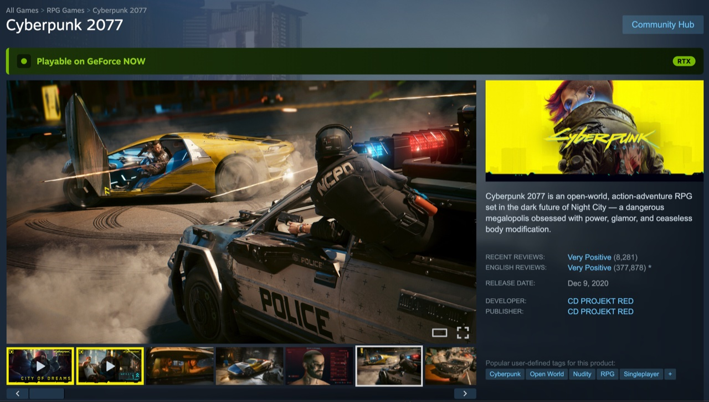
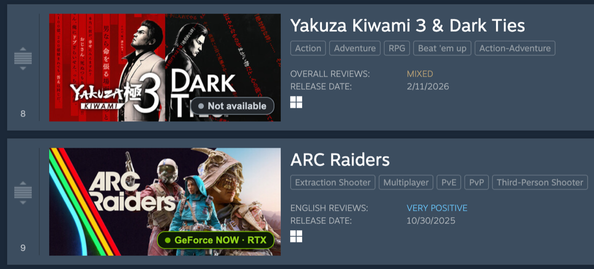

# GeForce NOW check for Steam (Firefox)

[](LICENSE)

A Firefox extension that badges Steam store and wishlist pages with NVIDIA
**GeForce NOW** availability — so you can see whether a game streams on GFN without
leaving Steam.

On any Steam game's store page or your wishlist, it checks the title against NVIDIA's
GeForce NOW catalog and draws a small badge:

- A green *Playable on GeForce NOW* marker (with an RTX chip on RTX-enabled titles) when
  the game is supported
- A neutral *Not available* marker when it isn't in the catalog
- A *couldn't check* state if the catalog is temporarily unreachable — it **never** shows
  a false "not supported"





## Install

- **Firefox Add-ons (AMO):** _listing pending review — link will go here once published._
- **Manual (signed `.xpi`):** download the latest `.xpi` from the
  [Releases](https://github.com/mjrossi/geforce-now-steam-check-firefox/releases) page and
  open it in Firefox.
- **Temporary (for testing a local build):** `about:debugging` → This Firefox → Load
  Temporary Add-on → pick any file in `dist/` after `just build`.

> This extension is in **beta**. Steam's wishlist markup changes often; if a badge looks
> wrong, please [open an issue](https://github.com/mjrossi/geforce-now-steam-check-firefox/issues).

## Privacy

> **No data collection, no analytics, no accounts.** The only network request is to
> NVIDIA's public GeForce NOW catalog (`https://games.geforce.com/graphql`); the catalog
> is cached locally for 12 hours and nothing about you or your browsing is ever
> transmitted.

See [PRIVACY.md](PRIVACY.md) for the full policy.

## How it works

A background script caches NVIDIA's GeForce NOW catalog (12 h TTL) and indexes it
by Steam app id. Content scripts on store/wishlist pages look games up and inject
namespaced (`gfn-check-*`) badges. Data source: the GFN catalog GraphQL API the
GeForce NOW web app uses, `https://games.geforce.com/graphql` (the legacy static
`gfnpc-*.json` feed is abandoned and returns false negatives — it is missing
large parts of the catalog, including newer titles).

The green RTX chip reflects each game's per-title `RTX_ENABLED` flag. Membership
tiers are not shown.

## Develop

Requires [mise](https://mise.jdx.dev).

```bash
mise install      # node + just
just install      # npm ci
just check        # typecheck + test + lint
just dev          # launch Firefox with the extension loaded
just package      # build a distributable zip
```

## Build from source

The published extension is bundled with esbuild. To reproduce `dist/` from a clean
checkout (this is also the procedure AMO reviewers follow):

```bash
mise install      # installs the pinned node + just (see mise.toml)
just install      # npm ci — installs exact deps from package-lock.json
just build        # node build.mjs → writes the unpacked extension to dist/
```

`build.mjs` bundles the three entry points as classic IIFE scripts and copies
`src/manifest.json`, `icons/`, and the extension HTML pages into `dist/`. No
post-processing, minification toggles, or environment variables are involved.

## Debugging

The background script honors two `browser.storage.local` flags. Set them from
the extension's background console (`about:debugging` → Inspect):

```js
// Log every lookup: index size, and hit/miss per app id.
browser.storage.local.set({ "gfn-debug": true });
// Force a one-time feed refetch, bypassing the 12 h cache (auto-clears).
browser.storage.local.set({ "gfn-force-refresh": true });
```

With `gfn-debug` on, reload a store page (e.g.
`https://store.steampowered.com/app/1285190/` for Borderlands 4) and check the
background console to see whether that app id is present in the indexed feed.

## License

[MIT](LICENSE) © mjrossi

GeForce NOW and RTX are trademarks of NVIDIA Corporation; Steam is a trademark of Valve
Corporation. This extension is an independent project and is not affiliated with,
endorsed by, or sponsored by NVIDIA or Valve.
